# 21Y08M-ARVacuum
ARVaccum Project at Korea University Internship

## 1. HCI 중심의 프로젝트 설계
> 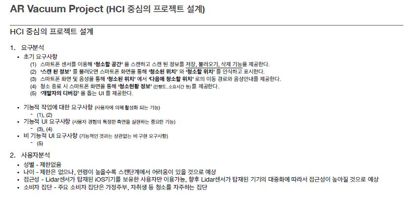</img>
> 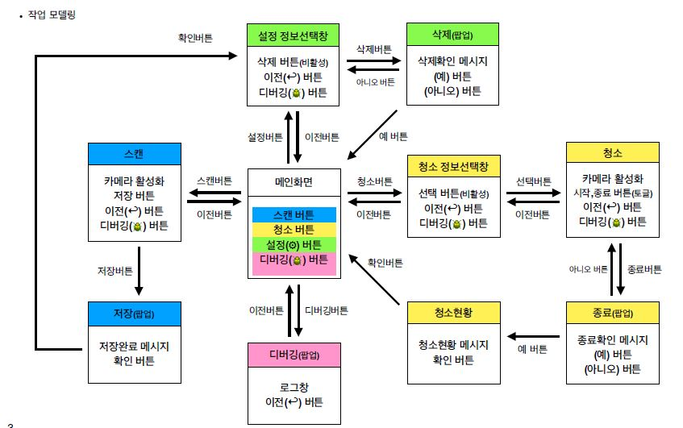</img>
> </img>
> </img>

## 2. UI설계
> 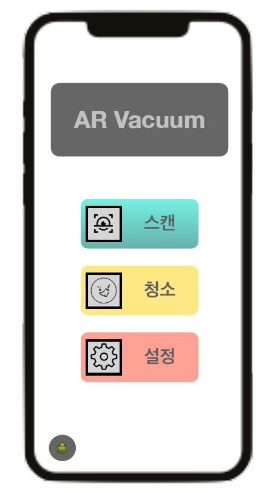</img>
> 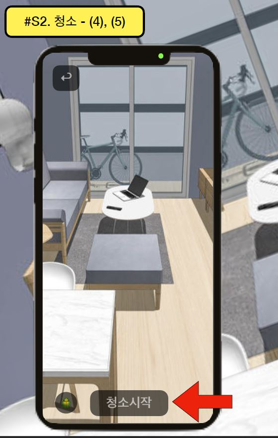</img>
> 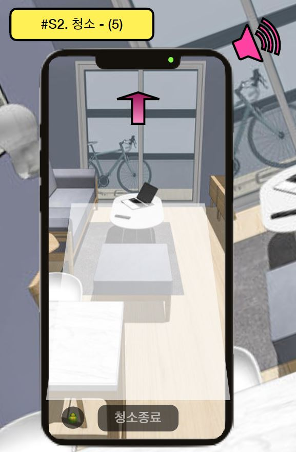</img>
> 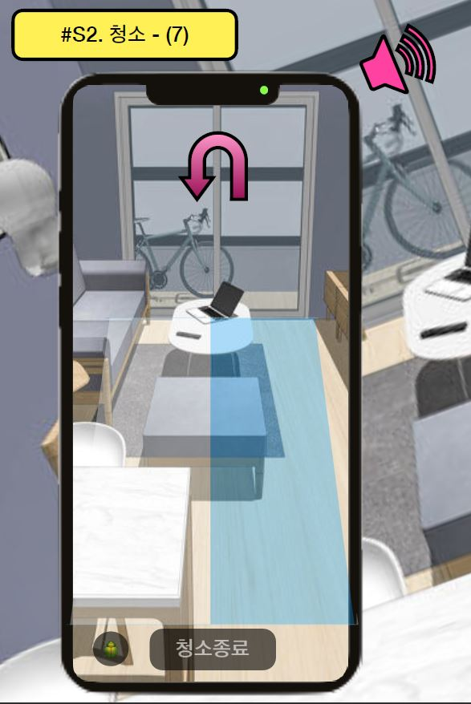</img>
> 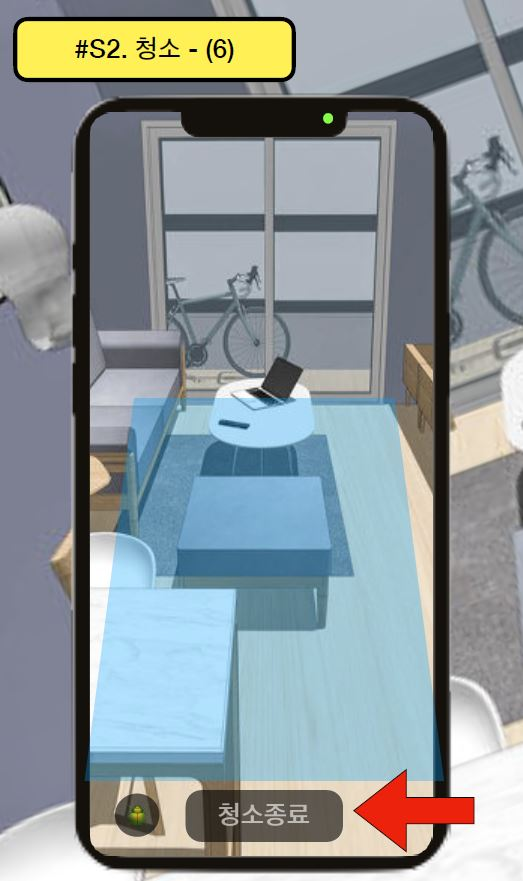</img>
> 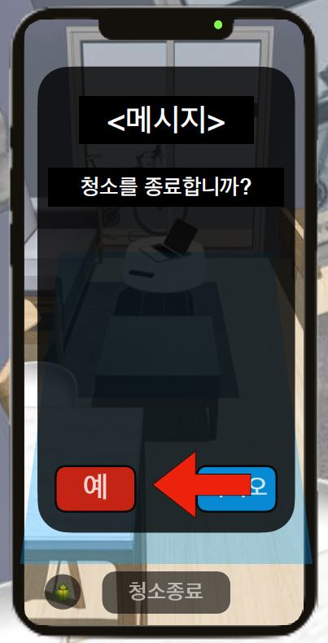</img>

## 3. 실제UI
> 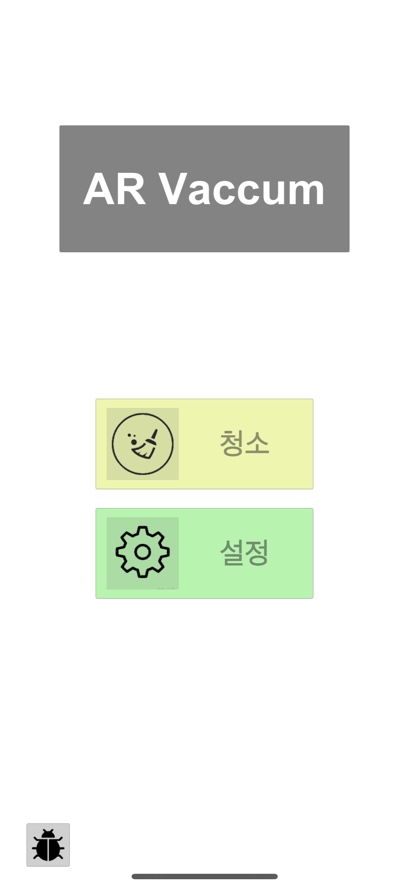</img>
> </img>
> </img>
> </img>
> 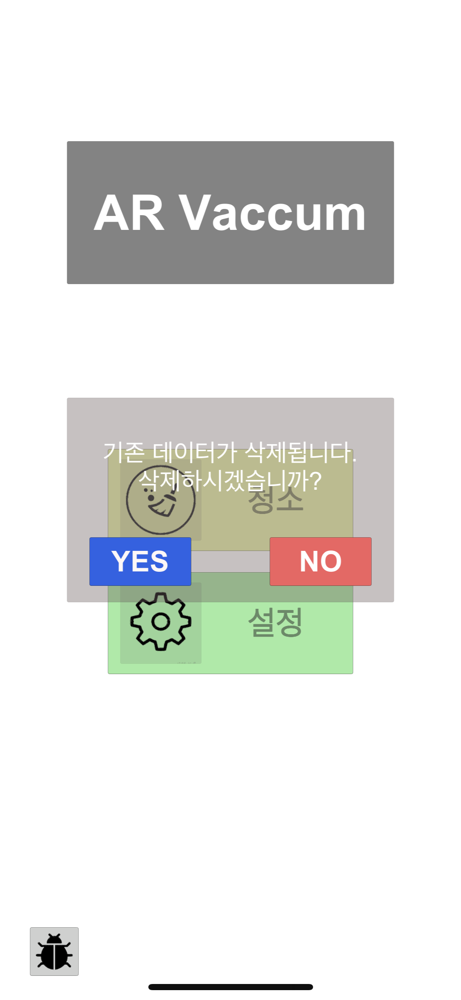</img>

## 4. Hardware
> 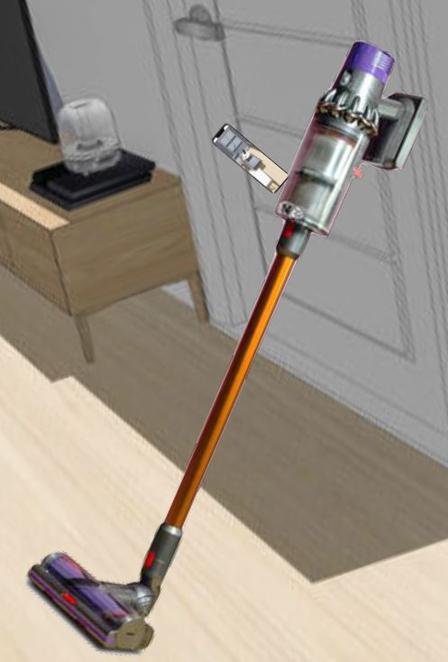</img>
> 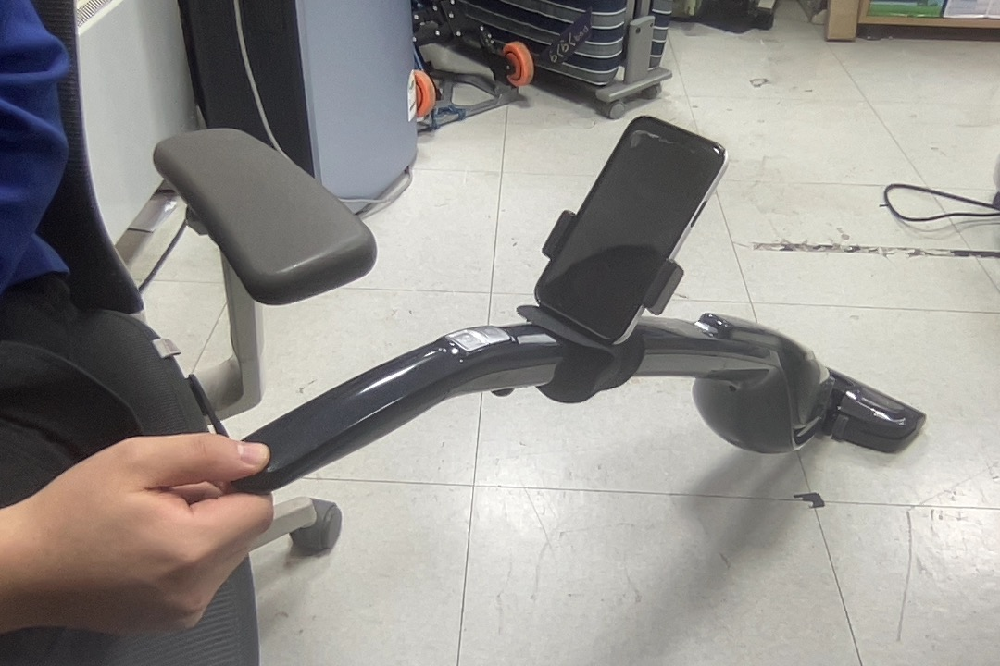</img>
