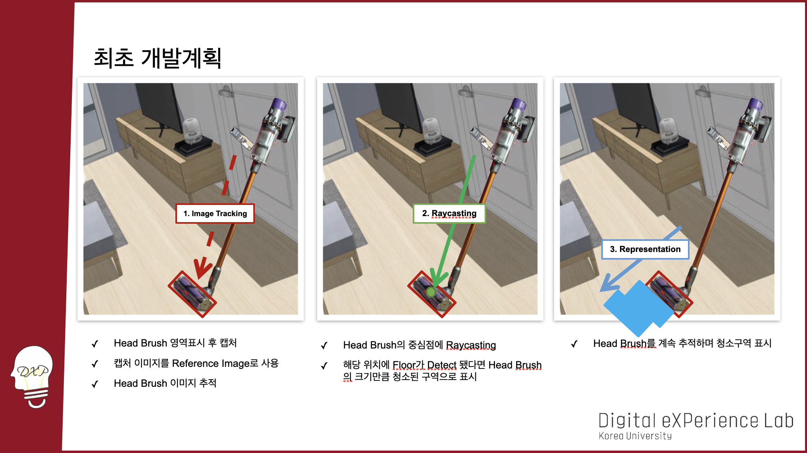

# 21Y08M-ARVacuum
ARVacuum Project at Korea University Internship

## 동영상
#### ⇩ Click Below Video ⇩

## 1. 프로젝트 개요와 구성
> </img>
> </img>

## 2. ARFoundation과 Native Plugin이란?
> </img> 
> </img>
> </img>

## 3. HCI 중심의 프로젝트 설계
> </img> 
> </img>
> </img>
> </img>
> </img>

## 4. UI설계와 Hardware
> </img>
> </img>

## 5. 최초 개발계획
> </img>

## 6. 시행착오
#### 시행착오1
> https://user-images.githubusercontent.com/22444743/149252150-13f1dd03-5bf2-4961-b6c4-77167c59e3ab.mp4

#### 시행착오2
> https://user-images.githubusercontent.com/22444743/149252184-a2b8aae1-ed93-45bd-942e-b15e99882fd4.mp4

#### 시행착오3
> https://user-images.githubusercontent.com/22444743/149252195-2ba65279-1684-4e3d-b158-788e0e8f30c0.mp4

#### 시행착오4
> https://user-images.githubusercontent.com/22444743/149252201-ccffc0cb-f0a5-4eb3-8dd2-e2c2bb8b5ff9.mp4

#### 시행착오5
> https://user-images.githubusercontent.com/22444743/149252249-20a8876e-b3ee-4268-a719-5f6ff28fbd45.mp4

## 참고사항
> </img>
> </img>
