# 21Y08M-ARVacuum

ARVaccum Project at Korea University Internship

## 1. 프로젝트 개요
> 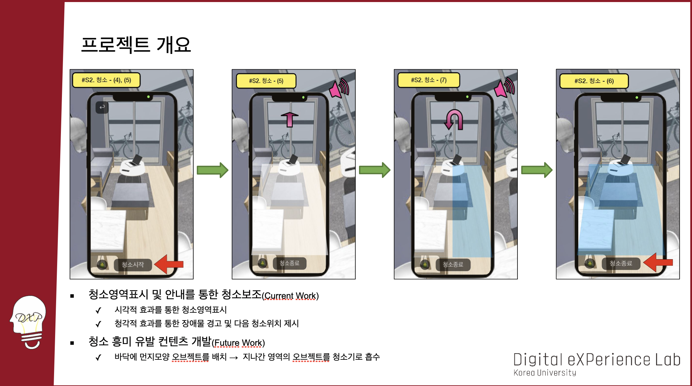</img>

## 2. 프로젝트 구성
> 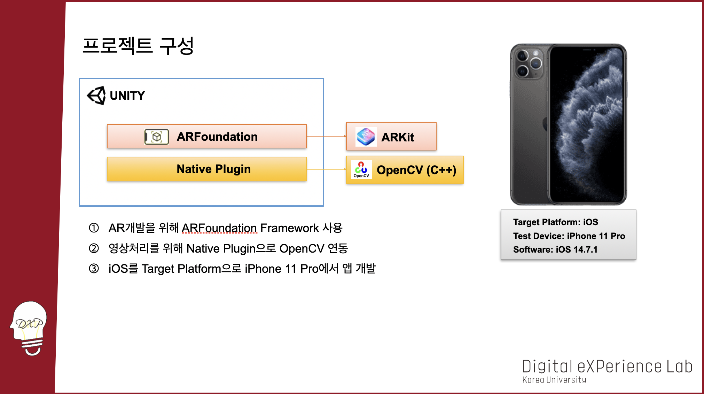</img>

## 3. ARFoundation이란?
> 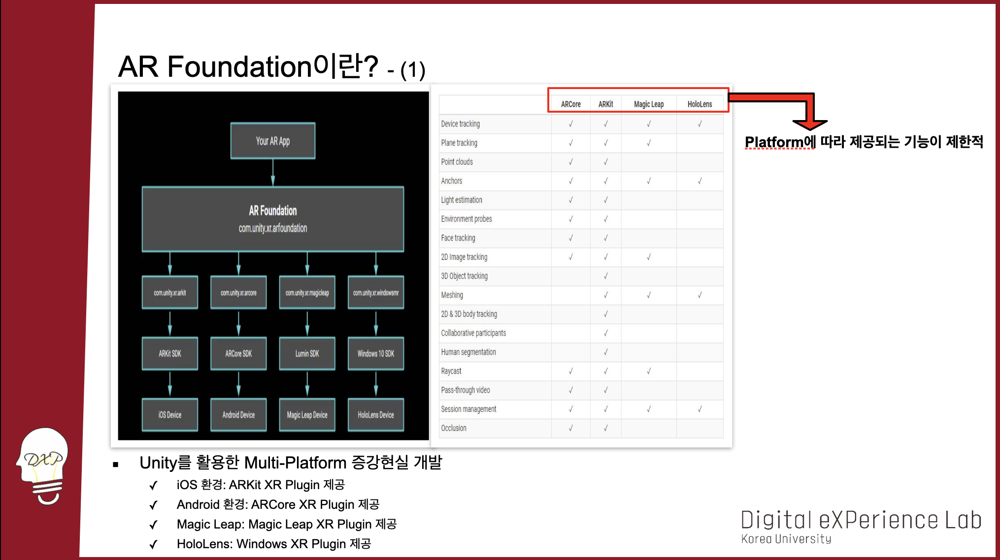</img> 
> 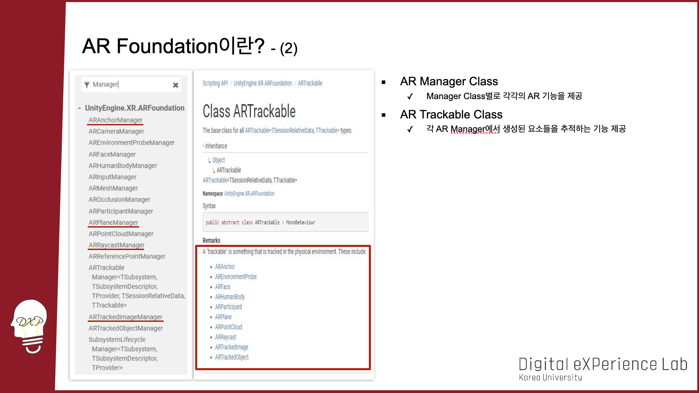</img>

## 4. Native Plugin이란?
> 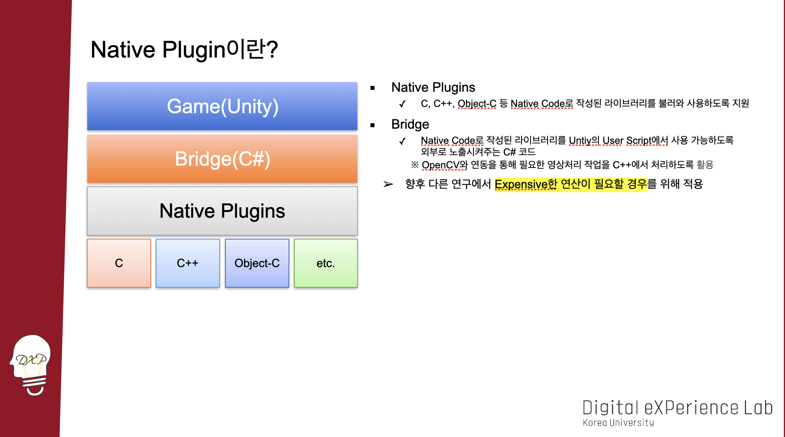</img>

## 5. HCI 중심의 프로젝트 설계
> 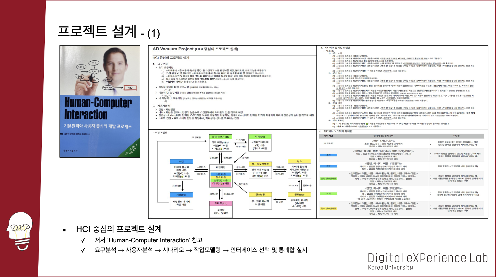</img> 
> 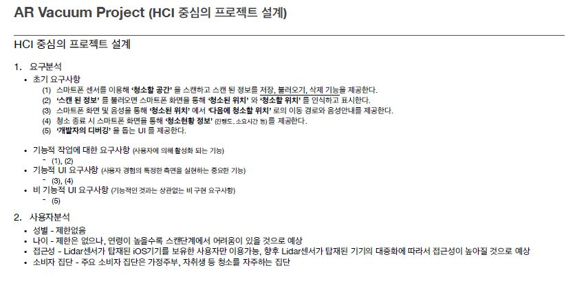</img>
> 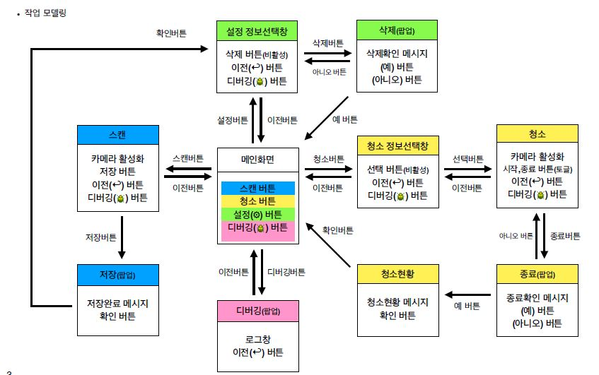</img>
> 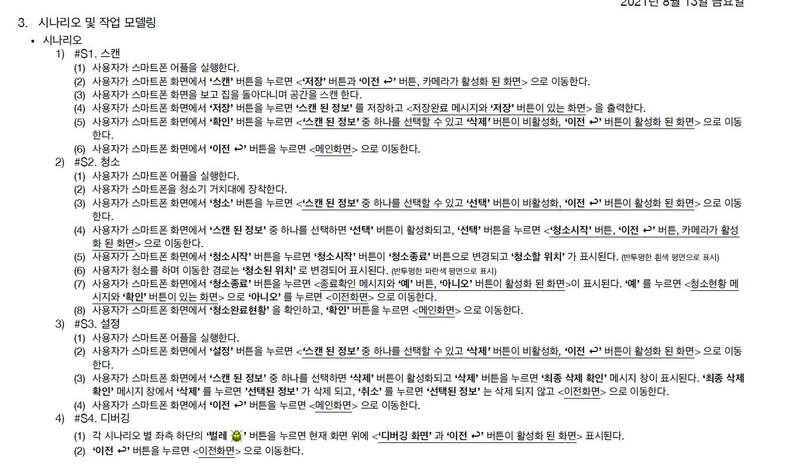</img>
> 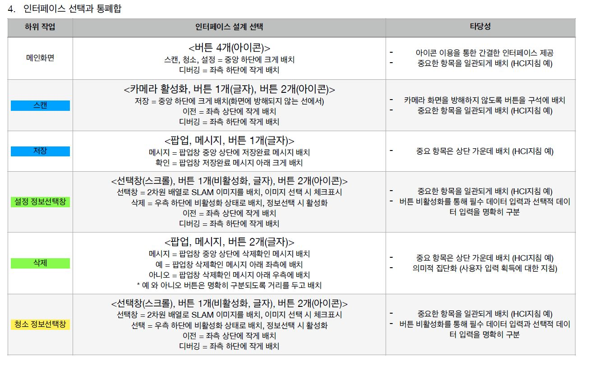</img>

## 6. UI설계와 실제UI
> 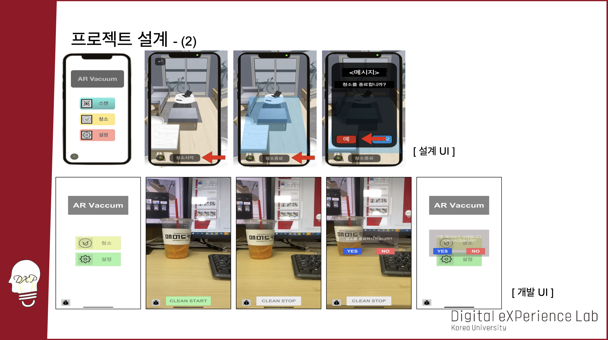</img>

## 7. Hardware
> 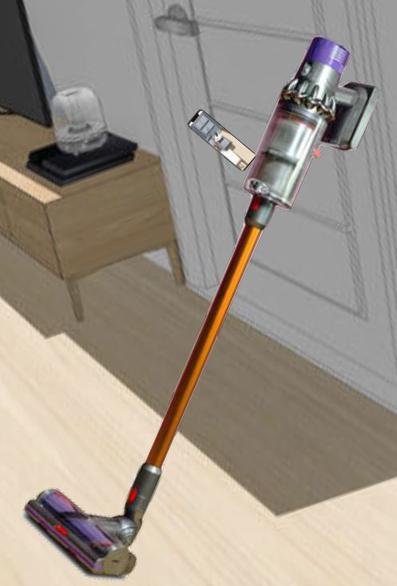</img>
> 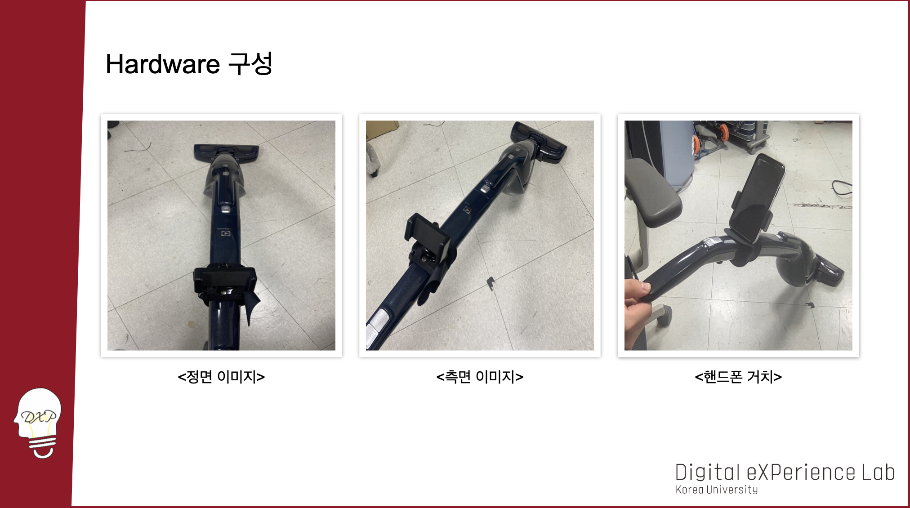</img>

## 참고사항
> 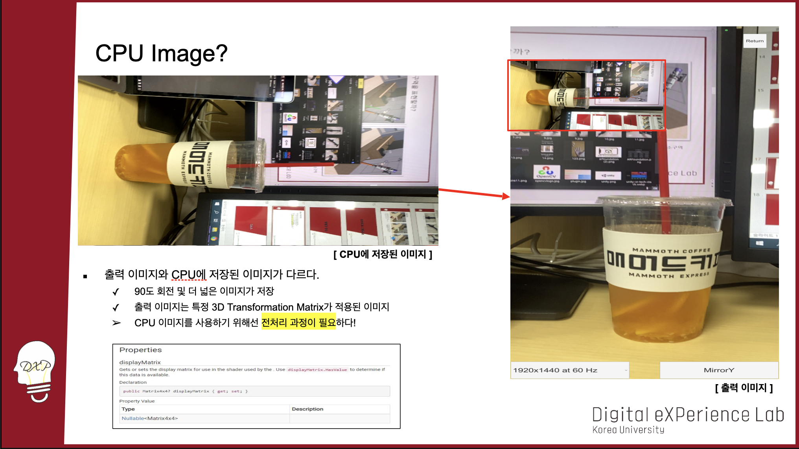</img>
> 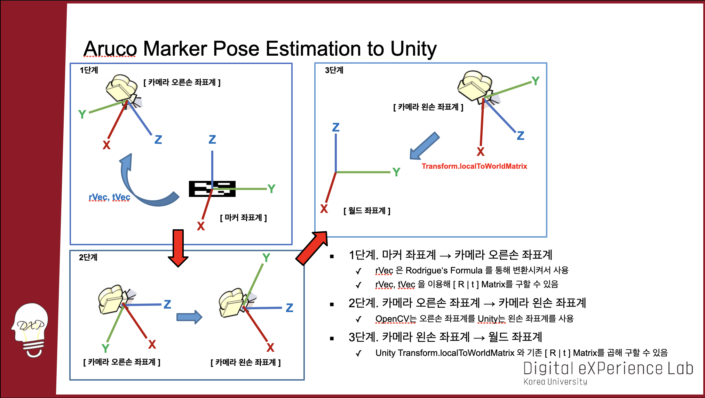</img>
